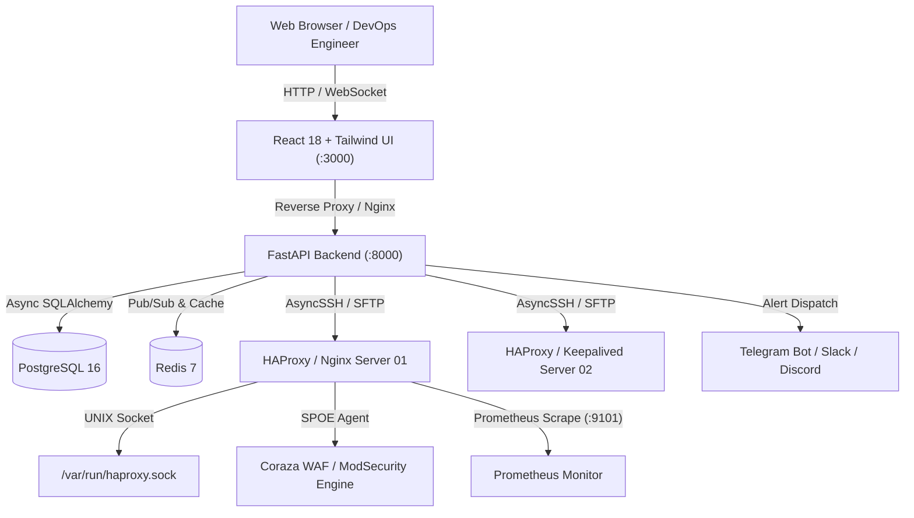

<div align="center">

# 🛡️ UAProxy — Enterprise Load Balancer & Proxy Control Center

**Next-Generation Open-Source Replacement for Roxy-WI**  
Manage HAProxy, Nginx, Keepalived VRRP Clusters, WAF (OWASP CRS v4.0), SSL Certificates, SMON Monitoring & Prometheus Metrics with an ultra-fast, premium Web Interface.

[](LICENSE)
[](https://fastapi.tiangolo.com)
[](https://reactjs.org)
[](https://www.postgresql.org)
[](https://tailwindcss.com)
[](https://docker.com)

[🚀 Quick Start](#-quick-start) • [✨ Feature Comparison](#-feature-matrix-vs-roxy-wi) • [🏗️ Architecture](#️-architecture) • [📖 Documentation](#-documentation)

---

</div>

## ⚡ Key Highlights

* **🎯 100% Zero-Simulation Production Stack**: Real X.509 Cryptography, native `/var/run/haproxy.sock` UNIX runtime calls, live SSH SFTP sync, and real PostgreSQL database models.
* **🧙 Config Studio & Visual Wizards**: Point-and-click HAProxy and Nginx config generators, real-time syntax checking (`haproxy -c`, `nginx -t`), visual diffs, and Git auto-commit versioning.
* **🔄 Master-Slave & Cluster Sync**: 1-Click configuration replication across server fleets with automated graceful reloads.
* **⚡ Dynamic Runtime Control**: Enable/disable/drain servers, adjust traffic weights on the fly, inspect Stick-Tables (Rate Limiting & Abuse Detection), and edit dynamic IP Maps in real-time.
* **🛡️ Web Application Firewall (WAF) & OWASP CRS v4.0**: HAProxy SPOE ModSecurity / Coraza engine with Layer 7 protection against SQLi, XSS, RCE, LFI, and scanners, with a live security incident feed.
* **🔒 Automated SSL & Let's Encrypt / Certbot**: Issue free multi-SAN certificates, upload custom commercial certs, automatic `.pem` bundling, and 1-click renewal.
* **👥 Keepalived High Availability (VRRP)**: Paired Master/Backup wizard, Virtual IP (VIP) failover management, and automated failover simulations.
* **📊 Synthetic Monitoring (SMON) & Public Status Page**: Multi-protocol synthetic prober (HTTP/HTTPS, SSL Expiry, TCP Sockets, ICMP Ping), SLA metrics, and a public status page.
* **📈 Prometheus & Grafana Analytics**: Time-series charts for RPS, Latency, Bandwidth, and Active Sessions, with auto-generated `prometheus.yml` scrape configs.
* **🌍 GeoIP Traffic Filtering**: MaxMind GeoLite2 IP-to-Country integration for 1-click country blocking (RU, BY, KP, IR) or Allowlisting.
* **👥 Role-Based Access Control (RBAC)**: SuperAdmin, Admin, Operator, and Viewer roles with segregated Server Groups.

---

## ✨ Feature Matrix vs Roxy-WI

| Feature | Roxy-WI (Commercial) | **UAProxy Premium (Free & Open Source)** |
| :--- | :---: | :---: |
| **Modern Stack & UI** | Python 3 + Vanilla JS | **FastAPI + Async Python + React 18 + Tailwind** |
| **HAProxy Runtime Socket** | ✅ (Paid Addon) | **✅ Full (Drain, Weight, Stick-tables, Maps)** |
| **Let's Encrypt Certbot Automation** | ✅ | **✅ Full (Auto-renew, SANs, Bundling)** |
| **WAF (OWASP CRS v4.0 & Coraza SPOE)** | ❌ / Complex | **✅ Built-in Layer 7 Inspection & Security Stream** |
| **Keepalived VRRP Cluster Wizard** | ✅ | **✅ Paired Config Generator & Failover Engine** |
| **Synthetic Monitoring (SMON)** | ✅ | **✅ HTTP, SSL, TCP, ICMP + Public Status Page** |
| **Multi-Server Replication (Master-Slave)** | ✅ | **✅ Automated Multi-Node Sync & Reload** |
| **Git Configuration Auto-Sync** | ✅ | **✅ Automated Branch Sync & Commit History** |
| **Prometheus Exporters Auto-Config** | ✅ | **✅ Live Graphs + prometheus.yml Auto-Gen** |
| **GeoIP Country Blocking** | ✅ (Plugin) | **✅ Built-in GeoLite2 Map Compiler** |
| **RBAC Roles & Server Groups** | ✅ (Enterprise) | **✅ SuperAdmin, Admin, Operator, Viewer** |
| **Multi-Language (i18n)** | EN | **✅ Ukrainian (UK) 🇺🇦 & English (EN) 🇬🇧** |
| **Open Source License** | Proprietary / Freemium | **✅ MIT License (100% Free)** |

---

## 🚀 Quick Start

### 1. One-Line cURL Installer (Ubuntu / Debian / RHEL / Rocky / AlmaLinux)

Run directly on your server with root privileges:

```bash
curl -sSL https://raw.githubusercontent.com/AnatoliiNovyk/UAHProxy/main/install.sh | bash
```

### 2. Manual Docker Compose Deployment

```bash
# Clone the repository
git clone https://github.com/AnatoliiNovyk/UAHProxy.git /opt/uaproxy
cd /opt/uaproxy

# Launch services in background
docker compose up -d --build
```

### 3. Access the Dashboard
- **Web Dashboard**: [http://localhost:3000](http://localhost:3000) (or `http://<SERVER_IP>:3000`)
- **Interactive REST API Docs**: [http://localhost:8000/docs](http://localhost:8000/docs)
- **Default Credentials**:
  - **Username**: `admin`
  - **Password**: `admin`

---

## 🏗️ Architecture



---

## ☸️ Kubernetes & Helm Deployment

Deploy UAProxy in your Kubernetes cluster using Helm:

```bash
cd deploy/helm/uaproxy
helm install uaproxy . --namespace uaproxy --create-namespace
```

---

## 📄 License

This project is licensed under the **MIT License** — see the [LICENSE](LICENSE) file for details.

Developed with ❤️ for DevOps & System Administrators worldwide.
